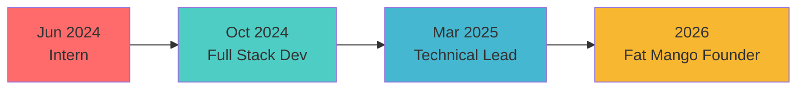

<h1 align="center">
    
</h1>

<h3 align="center">Technical Lead | Full-Stack Engineer | RAG Specialist 🚀</h3>
<h3 align="center">Building @ <a href="https://www.maximizemarketresearch.com/">Maximize Market Research</a> & <a href="https://www.fatmangosolutions.com/">Fat Mango Solutions</a></h3>

<br/>

<div align="center">

### 💻 What I Build
```ascii
🏗️  SaaS Platforms        →  End-to-end subscription marketplaces
🤖  RAG Pipelines         →  AI-powered retrieval & generation systems  
💳  Payment Systems       →  Webhook-driven, idempotent processing
🔐  Auth & RBAC          →  Tiered access, quotas, entitlements
⚡  Performance          →  Core Web Vitals, structured data, SEO
```

</div>

<div align="center">

🔭 Currently: **Leading production systems & RAG implementations**  
🧠 Deep diving: **RAG architectures, vector databases, LLM orchestration**  
🌱 Building: **AI-powered automation workflows with Python & TypeScript**  
💬 Ask me about: **Next.js, MongoDB, RAG pipelines, payment integrations**  

</div>
 
<br/>

<div align="center"> 
  <a href="mailto:yashrajjghosalkar@gmail.com">
    
  </a>
  <a href="https://www.linkedin.com/in/yashrajghosalkar/" target="_blank">
    
  </a>
  <a href="https://mmrstatistics.com" target="_blank">
     
  </a>
  <a href="https://www.fatmangosolutions.com/" target="_blank">
     
  </a>
</div>

<hr/>
 
<h2 align="center">⚡ Tech Arsenal</h2>
<br/>

<div align="center">
    
    
</div>

<br/>

<table align="center">
  <tr>
    <td align="center" width="50%">
      <b>🎯 Full-Stack</b><br/>
      Next.js • React • Node.js • Express<br/>
      TypeScript • MongoDB • MySQL<br/>
      REST APIs • Webhooks • RBAC
    </td>
    <td align="center" width="50%">
      <b>🤖 AI & Automation</b><br/>
      Python • RAG Pipelines<br/>
      LangChain • Vector DBs<br/>
      LLM Orchestration • Embeddings
    </td>
  </tr>
  <tr>
    <td align="center" width="50%">
      <b>☁️ Cloud & DevOps</b><br/>
      AWS (EC2, S3, CloudFront)<br/>
      Docker • CI/CD • Linux<br/>
      GitHub Actions • Cloudflare
    </td>
    <td align="center" width="50%">
      <b>💳 Payments & Events</b><br/>
      HDFC • Juspay Integration<br/>
      Webhook Reconciliation<br/>
      State Machines • Audit Trails
    </td>
  </tr>
</table>

<hr/>

<h2 align="center">🚀 Featured Work</h2>

<div align="center">

<table>
<tr>
<td width="50%">

### 🎯 [MMR Statistics](https://mmrstatistics.com)
**Production SaaS • Sole Developer**
```yaml
Stack: Next.js + TypeScript + MongoDB
Features:
  - Subscription tiers with RBAC
  - Payment gateway integration
  - Admin & Analyst workspaces
  - Async export pipeline
  - CI/CD + Performance optimization
```

</td>
<td width="50%">

### 🥭 [Fat Mango Solutions](https://fatmangosolutions.com)
**Digital Studio • Founder**
```yaml
Services: 
  - Full-stack development
  - SaaS platforms
  - Digital marketing
  - SEO & performance
  - Brand & design
```

</td>
</tr>
</table>

</div>

<hr/>

<h2 align="center">🤖 RAG & AI Focus</h2>

<div align="center">

Currently building and optimizing **RAG (Retrieval-Augmented Generation)** pipelines:
```python
# What I'm working on
pipeline = {
    "retrieval": ["Vector DBs", "Semantic Search", "Hybrid Search"],
    "augmentation": ["Context Injection", "Query Rewriting", "Re-ranking"],
    "generation": ["LLM Orchestration", "Prompt Engineering", "Response Validation"],
    "stack": ["Python", "LangChain", "OpenAI/Anthropic APIs", "ChromaDB/Pinecone"]
}
```

Building intelligent systems that combine **traditional full-stack architecture** with **AI-powered automation**.

</div>

<hr/>

<h2 align="center">📊 GitHub Activity</h2>

<div align="center">
  
</div>

<br/>

<div align="center">
  
  
</div>

<hr/>

<h2 align="center">🎯 Journey</h2>

<div align="center">
    


**Education:**  
🎓 B.Tech CSE - Manipal University Jaipur (7.77 CGPA)  
🎓 Diploma IT - Govt. Polytechnic Kolhapur (93.56%)

</div>

<hr/>

<div align="center">
  
### 💭 Philosophy

> *"If you do what you love, you'll never work a day in your life."*  
> That's how I feel about architecting software. Every challenge is just a fun puzzle waiting to be solved.

<br/>

**🔥 Open to collaborations • Let's build something amazing 🚀**

</div>

<br/>

<div align="center">
  
</div>
